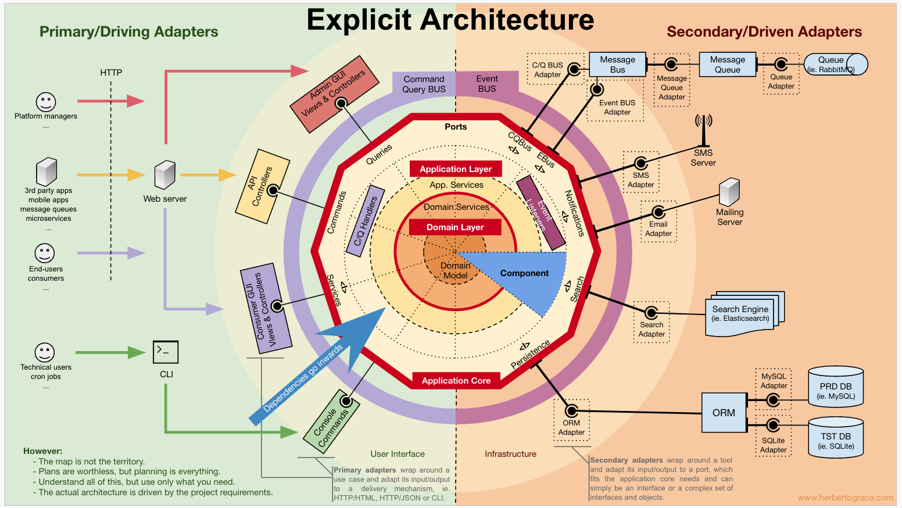

# 👀 Hexagonal Architecture in Node.js

> An hexagonal architecture using Nest.js and Typescript

<a href="https://www.npmjs.com/~nestjscore" target="_blank"></a>
<a href="https://www.npmjs.com/~nestjscore" target="_blank"></a>

### First step
```bash
$ yarn install
```

### Running app
```bash
# development
$ yarn run start

# watch mode
$ yarn run start:dev

# production mode
$ yarn run start:prod
```

### Test
```bash
$ yarn run test
```

## Example request 

```bash
curl --location --request GET 'localhost:3000/user/0x0fe3'
```

### Related articles
* https://www.youtube.com/watch?v=th4AgBcrEHA&list=PLGl1Jc8ErU1w27y8-7Gdcloy1tHO7NriL
* https://herbertograca.com/2017/11/16/explicit-architecture-01-ddd-hexagonal-onion-clean-cqrs-how-i-put-it-all-together/



